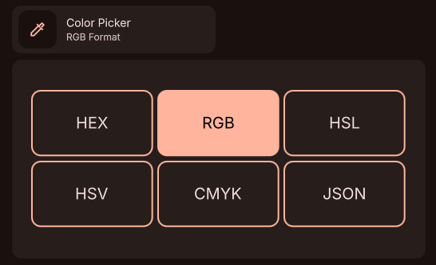

# DMS Format Color Plugin

A [DMS (Dank Material Shell)](https://github.com/nicknisi/dank-material-shell) plugin for choosing color format before picking, directly from the Control Center.

## Features

- Choose between 6 different formats right from the Control Center.
- Bar widget lets you quickly pick in the selected color format.

## Screenshot


## Installation

### Manual

Copy or symlink this directory into the DMS plugins folder:

```bash
ln -s /path/to/dms-format-color-picker ~/.config/DankMaterialShell/plugins/dms-format-color-picker
```

Then reload DMS:

```bash
dms restart
```

## Requirements

- [DMS](https://github.com/nicknisi/dank-material-shell) v1.4+

## License
GPLv3
